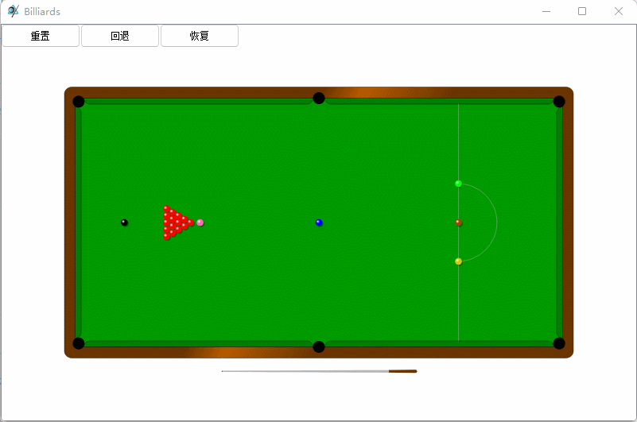

## 项目作品：[https://blog.csdn.net/yiboyuntian_qt/article/details/140702774](https://blog.csdn.net/yiboyuntian_qt/article/details/140702774?spm=1001.2014.3001.5501)

## 百度网盘：（bin目录含打包好的exe应用程序及场景）：[https://pan.baidu.com/s/1islrLbo2mdaNvzTcXVYY7Q?pwd=1008](https://pan.baidu.com/s/1id6rITK1klngrsAM-Vq4jg?pwd=1008 )

## 项目介绍：

qt c++ 编写台球游戏， 使用QGraphicsView QGraphicsScene QGraphicsItem ，掌握qt图形视图框架。

## 效果图：

